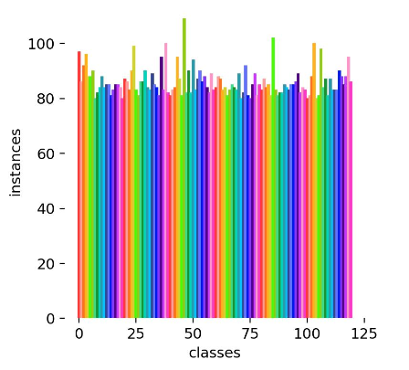
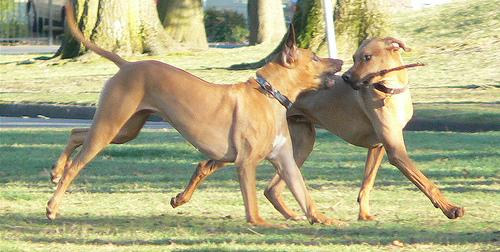

# DogBreed

This is a project tries to classify dog images into a 
predefined number of breeds. First we have no information considering the
data. We inspect that data consist of 120 classes of Dog Breeds.

To ensure a balanced distribution between labels in the dataset, we plotted a graph showing 120 classes with approximately 80-100 instances per category.

Data augmentation is applied by default during training in YOLOv8 ([config](https://docs.ultralytics.com/usage/cfg/#augmentation)).

One challenge with this dataset is that images exhibit different styles in terms of background, and they are of varying shapes. The strategy we will follow to address this issue is as follows:

### 1) Easy Solution
Addressing the problem as a simple classification task, ignoring annotations. 
This straightforward approach treats the task as a vanilla classification problem, 
which is the fastest and easiest solution. 
However, it may yield undesired results when dealing with images containing multiple 
annotations or diverse backgrounds.
Example:

### 2) Improved Solution
Another sophisticated solution involves training YOLOv8 as an 
object detector using the initial annotations (boxes of dogs) with multiple breeds. 
The model outputs boxes with labels, but we focus on the class (breed) rather than 
the box coordinates. The key metric is loss_cls, 
measuring the correctness of the classification, not loss_bbox. 
Parameters used: 
epochs=100, 
imgsz=180, 
batch=32. 
patience=15 (halt training if no improvement in loss is observed for a certain number of epochs)
### 3) Two step Solution 
This approach comprises two models. 
The first detects the dog in the image, treating all labels with categories as a single 'Dog.' 
The YOLOv8 object detector locates the dog, providing a bounding box. 
The second model is a classifier directly applied to the cropped object, aiming to classify the breed.
### 4) Crop Classification Solution 
Another approach for this problem would be using annotations only in the training set.
Cropping images and let valid and test set have the complete information. The task is a classification 
problem in this case.

#### How to use my repo 
If you want to use my repo without building an Anaconda env you can simply build
a docker image (for 'dogbreed' you can use another name) :
docker build -t dogbreed .
After you build the image you can run 
`docker build -t dogbreed .
 docker run dogbreed`