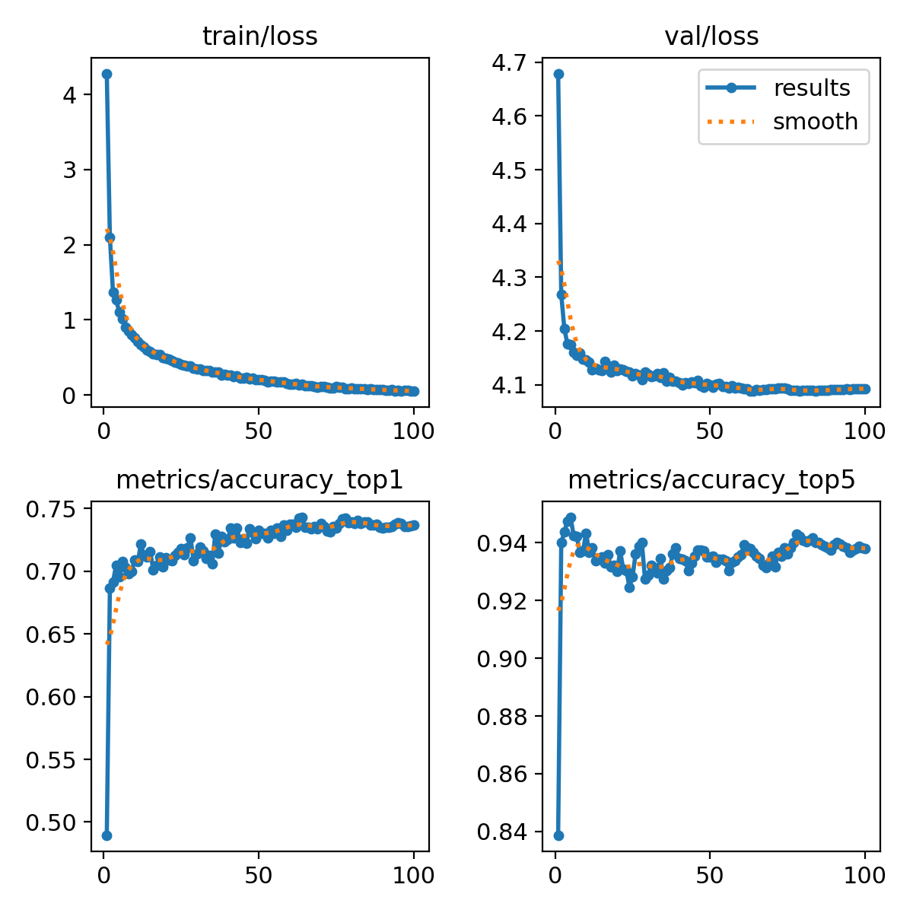
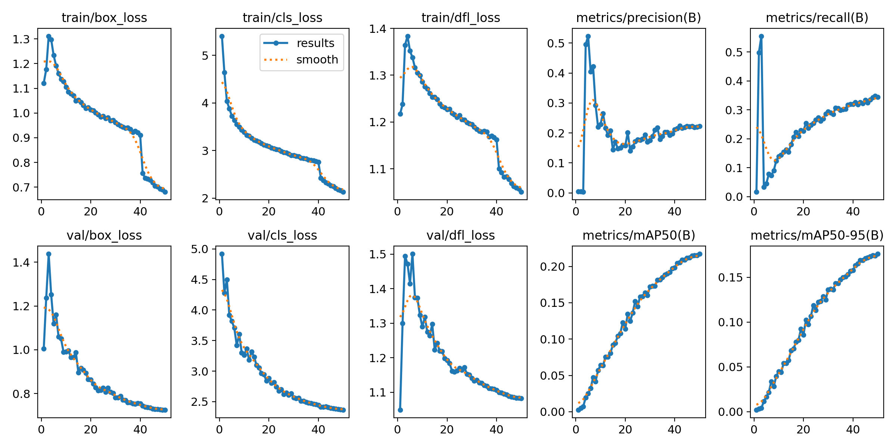

# Dog Breed Classification Project
### General
This project aims to classify dog images into 120 predefined breeds. 
The dataset appears balanced, with each of the 120 classes having approximately 80-100 instances.
To ensure a balanced distribution between labels in the dataset, we plot a graph showing the samples label 
occurence.
We see that the 120 classes consist of approximately 80-100 instances per category so we conclude that
we have a general balanced dataset.

Data augmentation, using YOLOv8, is applied during training by default to improve model performance.
(see [config](https://docs.ultralytics.com/usage/cfg/#augmentation)).

### Challenges
1. The dataset exhibits different styles in terms of background, and images have varying shapes.
2. Some dog breeds are have similar appearance, and the dataset lacks sufficient samples for the 120 classes.

### Approaches
#### 1) Easy Solution 
This approach treats the task as a classification problem, ignoring box annotations. 
This straightforward approach is fast but may yield undesired results when dealing with images containing multiple 
annotations or diverse backgrounds.   
Example:  

#### 2) Improved Solution
A more sophisticated solution involves training YOLOv8 as an 
object detector using the initial annotations (boxes of dogs) with multiple breeds. 
The model outputs boxes with labels, and we focus on the class (breed) rather than 
the box coordinates. The key metric is loss_cls, measuring the correctness of the classification, not loss_bbox. 
#### 3) Two step Solution (not implemented)
This approach comprises two models. 
The first detects the dog in the image, treating all labels with categories as a single 'Dog.' 
The YOLOv8 object detector locates the dog, providing a bounding box. 
The second model is a classifier specifically applied to the cropped object. Its goal is to classify the dog breed.
This two-step process is designed to assist the classifier in making decisions based solely on the dog frame, 
excluding background elements that might introduce confusion to the model.
#### 4) Crop Classification Solution (not implemented) 
The initial step involves cropping images based on the provided annotations. 
This steps does not affect validation and test set. 
Utilizing the cropped images as the training set we classify the breeds. 
One drawback of this method is that the test set may significantly differ from the training set, 
particularly in images with divergent backgrounds.

### How to use this repository
If you want to utilize this repository without building an Anaconda environment, you can simply build a Docker image. 
For example, let's name it 'dogbreed':   
`docker build -t dogbreed .`  
After building the image you can run which will open a bash shell:   
`docker run dogbreed`

### Setup-Parameters
To initiate the training process, refer to `main_train.py`, and for evaluating the trained models, check `main_results.py`. 
Ensure the dataset is unzipped in your local directory before running these files. 
If you're using the Docker image, this step is not required as the docker image includes
those data.  
Before running the training and evaluation scripts, you may choose the solution/s you want to implement. 
Options include ['SOLUTION_1', 'SOLUTION_2'].
#### Model Size
This repo also allows you to experiment with different model sizes. 
Choose from ['n', 's', 'm', 'l', 'x']. 
For instance, selecting 'n' will use the [yolov8n.pt](https://docs.ultralytics.com/models/yolov8/) for training (where 'n' stands for nano). 
Due to limited resources, models were trained with size 's'.

#### Dataset Information
The initial set consists of train and test set. 
Train set consists of 12000 samples. First step of Trainer object is to split the training data into train-valid in a stratified manner. 
Since examples are not many with respect to number of classes we need to guarantee that the number of samples 
for each class is balanced.    
For the splitting we utilize two parameters valid_size and random_state. 
The random_state is the seed used by the random number generator which we set to 42, Valid_size parameter 
should be between 0.0 and 1.0 and represent the proportion of the dataset to include in the validation split.
For all the experiments we set this parameter to 0.2 which is a common standard. 

#### Model Training Parameters
We also have other adjustable parameters such as epochs, batch size and patience. 
For solution 1 the model_kwargs are set as following:    
`model_kwargs={'epochs': 100, 
               'batch': 16, 
                'imgsz': 224,
               'patience': 25}`   
For the solution 2 due to time limitations half of the epochs were utilized such 
as:    
`model_kwargs={'epochs': 50, 
                'imgsz': 128,
                'batch': 64, 
                'patience': 25},`
Note that by using model_kwargs any training configuration parameters found [here](https://docs.ultralytics.com/usage/cfg/) can passed into the training

The yolov8_imgs folder will be built before training by the Trainer following the requested dataset format
for yolov8. This folder will automatically removed after training.
The structure is the following:   

For classification (solution 1) we get a training accuracy (top1) of 0.74 and (top5) 0.94 respectively 
while in test set accuracy score is 0.74. This means that we don't have any overfit case here.
For other metrics, plus the confusion matrix you may run main_results.py or visit runs folder 
in which much information about training is stored.
Training curves for solution 1:   

For the detection model (solution 2) we get a training accuracy
of 0.20 which is expected since we reduced model size, sample sizes and epochs.
Training curves for solution 2 present that the model is able to learn 
In the curves we can see that the model hasn't converged yet, so the optimization process is still ongoing, 
and the model hasn't reached a stable solution. This makes us confident that
the model might perform better in longer epochs.

